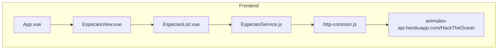

# Guardians Of The Ocean - Hack The Ocean (Frontend)

El repositorio del backend puede visualizarse mediante [este enlace](https://github.com/AleGV258/GuardiansOfTheOcean_HackTheOcean_Back).

El despliegue de este sitio web puede visitarse en el siguiente enlace: [https://guardiansoftheocean.netlify/](https://guardiansoftheocean.netlify.app/#/).

# Problemática central

Los océanos conforman más del 70% de la superficie de la Tierra, sin embargo, son uno de los hábitats menos investigados por el ser humano. Esto ha provocado que exista una indiferencia hacia la fauna y flora que habita en este lugar, y sobre todo a su conservación y preservación. Actualmente existen cerca de 250,000 especies conocidas que surcan los mares, sin embargo, informes de la Unión Internacional para la Conservación de la Naturaleza estiman que, en la actualidad, se tienen 181 especies marinas que, por desgracia, han desaparecido de la faz de la Tierra; ya sea por cuestiones naturales o por intervención humana, lo cierto es que esta última es la causa en la mayoría de los casos de especies en peligro de sufrir este terrible destino.

# Propuesta de solución

Dado el desconocimiento que existe sobre este hábitat y, por ende, una indiferencia hacia su conservación o incluso aprendizaje, se propone crear un sitio web que proporcione al usuario información relacionada con los animales que actualmente se encuentran en peligro de extinción con el objetivo de enseñar a la vez que se crea conciencia sobre el cuidado y preservación de dichas especies.

# Objetivo del Frontend

Dar a conocer por medio de la pagina web, la problemática de la extinción de los animales marinos, el cuales son estas especies, por que se están extinguiendo y en que estado se encuentran, se busca concientizar el gran daño que se le esta haciendo a la fauna marina y que de no hacer nada, la fauna marina desaparecería

# Conexión del Frontend con la API

# Descripcion de cada vista

## HomeView

Es la vista de nuestro sitio al solo entrar, compuesto por un nav que nos dirigirán a diferentes partes de nuestro sitio, una pequeña descripción de Guardians of the Ocean, ONGś de interés para la preservación de las especies en peligro de extinción, una sección con unos ejemplos de los animales en peligro de extinción junto a un botón que nos lleva a la siguiente pagina donde se nos muestra la lista completa de los animales en peligro de extinción.

## EspeciesView

Esta es una vista donde mostramos todos los animales en peligro de extinción obtenido por una API creada por nuestro equipo de backend, que mostrando cada especie con foto, nombre, descripción, ubicación, estado de peligro y la causa de peligro.